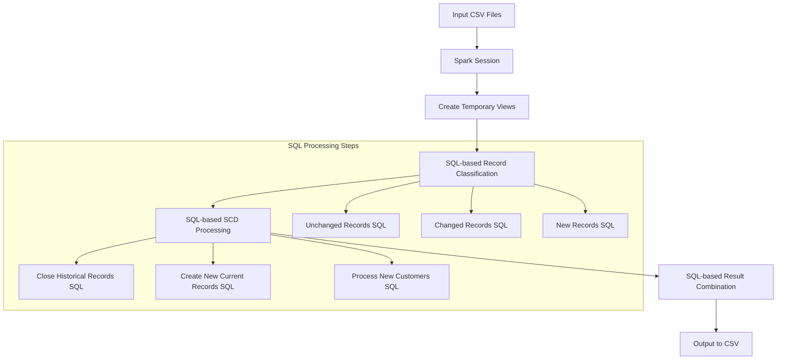

# Design Document

## Overview

This design converts the existing PySpark DataFrame-based SCD Type II implementation to use pure SparkSQL statements. The solution maintains the same business logic and data processing flow but leverages SQL's declarative syntax for better readability and potential query optimization. The implementation will execute on Google Cloud Dataproc and handle the same customer data scenarios as the original PySpark version.

## Architecture

### High-Level Architecture



### Data Flow Architecture

1. **Data Ingestion**: Load CSV files into Spark DataFrames
2. **View Creation**: Register DataFrames as temporary SQL views
3. **Record Classification**: Use SQL JOINs and CASE statements to identify record types
4. **SCD Processing**: Execute SQL statements for each SCD operation
5. **Result Assembly**: Use SQL UNION operations to combine all processed records
6. **Output Generation**: Save final results to distributed storage

## Components and Interfaces

### Core Components

#### 1. SparkSQL Session Manager
```python
class SparkSQLSessionManager:
    def create_session(self) -> SparkSession
    def register_temp_views(self, existing_df, new_df) -> None
    def execute_sql(self, query: str) -> DataFrame
```

#### 2. SQL Query Builder
```python
class SCDSQLQueries:
    def get_unchanged_records_query(self) -> str
    def get_changed_records_query(self) -> str
    def get_new_records_query(self) -> str
    def get_close_records_query(self, source_date: str) -> str
    def get_create_new_current_query(self, next_key: int, source_date: str) -> str
    def get_final_union_query(self) -> str
```

#### 3. SCD Type II Processor
```python
class SparkSQLSCDProcessor:
    def process_scd_type2(self, existing_path: str, new_path: str, output_path: str) -> None
    def classify_records(self) -> Tuple[DataFrame, DataFrame, DataFrame]
    def process_unchanged_records(self) -> DataFrame
    def process_changed_records(self, source_date: str) -> Tuple[DataFrame, DataFrame]
    def process_new_records(self, next_key: int, source_date: str) -> DataFrame
    def combine_all_results(self) -> DataFrame
```

### SQL Query Interfaces

#### Record Classification Queries

**Unchanged Records Query:**
```sql
SELECT curr.*
FROM existing_customers curr
INNER JOIN new_customers new ON curr.customer_id = new.customer_id
WHERE curr.is_current = true
  AND curr.customer_name = new.customer_name
  AND curr.address = new.address
  AND curr.phone = new.phone
  AND curr.email = new.email
```

**Changed Records Query:**
```sql
SELECT curr.*, new.*
FROM existing_customers curr
INNER JOIN new_customers new ON curr.customer_id = new.customer_id
WHERE curr.is_current = true
  AND (curr.customer_name != new.customer_name
       OR curr.address != new.address
       OR curr.phone != new.phone
       OR curr.email != new.email)
```

**New Records Query:**
```sql
SELECT new.*
FROM new_customers new
LEFT JOIN existing_customers curr ON new.customer_id = curr.customer_id
WHERE curr.customer_id IS NULL
```

#### SCD Processing Queries

**Close Historical Records:**
```sql
SELECT 
    customer_key,
    customer_id,
    customer_name,
    address,
    phone,
    email,
    effective_start_date,
    CAST('{source_date}' AS DATE) as effective_end_date,
    false as is_current
FROM existing_customers
WHERE customer_id IN (SELECT customer_id FROM changed_records)
  AND is_current = true
```

**Create New Current Records:**
```sql
SELECT 
    {next_key} + ROW_NUMBER() OVER (ORDER BY customer_id) - 1 as customer_key,
    customer_id,
    customer_name,
    address,
    phone,
    email,
    CAST(source_date AS DATE) as effective_start_date,
    CAST('9999-12-31' AS DATE) as effective_end_date,
    true as is_current
FROM changed_records_new_data
```

## Data Models

### Input Data Models

#### Existing Customer Dimension Schema
```sql
CREATE TABLE existing_customers (
    customer_key INT NOT NULL,
    customer_id INT NOT NULL,
    customer_name STRING NOT NULL,
    address STRING NOT NULL,
    phone STRING NOT NULL,
    email STRING NOT NULL,
    effective_start_date DATE NOT NULL,
    effective_end_date DATE NOT NULL,
    is_current BOOLEAN NOT NULL
)
```

#### New Customer Source Schema
```sql
CREATE TABLE new_customers (
    customer_id INT NOT NULL,
    customer_name STRING NOT NULL,
    address STRING NOT NULL,
    phone STRING NOT NULL,
    email STRING NOT NULL,
    source_date DATE NOT NULL
)
```

### Intermediate Data Models

#### Record Classification Views
- `unchanged_records`: Records with no attribute changes
- `changed_records`: Records with attribute modifications
- `new_records`: Completely new customer records

#### Processing Result Views
- `closed_historical`: Historical records with updated end dates
- `new_current_changed`: New current records for changed customers
- `new_current_customers`: Records for completely new customers

### Output Data Model

#### Final Customer Dimension Schema
```sql
CREATE TABLE customer_dimension_final (
    customer_key INT NOT NULL,
    customer_id INT NOT NULL,
    customer_name STRING NOT NULL,
    address STRING NOT NULL,
    phone STRING NOT NULL,
    email STRING NOT NULL,
    effective_start_date DATE NOT NULL,
    effective_end_date DATE NOT NULL,
    is_current BOOLEAN NOT NULL
)
```

## Error Handling

### SQL Execution Error Handling

1. **Query Validation**: Validate SQL syntax before execution
2. **Data Type Errors**: Handle casting and type conversion failures
3. **Join Failures**: Manage scenarios where expected joins produce no results
4. **Surrogate Key Generation**: Handle edge cases in ROW_NUMBER() window functions

### Data Quality Error Handling

1. **Missing Data**: Handle NULL values in key fields
2. **Duplicate Keys**: Detect and handle duplicate customer_ids in source data
3. **Date Format Errors**: Validate and convert date strings properly
4. **Schema Mismatches**: Verify expected columns exist in input files

### Resource Error Handling

1. **Memory Management**: Handle large datasets that may cause OOM errors
2. **Cluster Connectivity**: Manage Dataproc cluster connection issues
3. **Storage Access**: Handle GCS or local storage read/write failures
4. **Spark Session Failures**: Properly restart sessions on failures

## Testing Strategy

### Unit Testing Approach

#### SQL Query Testing
```python
class TestSCDSQLQueries:
    def test_unchanged_records_query_syntax(self)
    def test_changed_records_query_logic(self)
    def test_new_records_query_completeness(self)
    def test_surrogate_key_generation_sql(self)
```

#### Data Processing Testing
```python
class TestSparkSQLSCDProcessor:
    def test_record_classification_accuracy(self)
    def test_scd_processing_correctness(self)
    def test_result_combination_completeness(self)
    def test_final_record_counts(self)
```

### Integration Testing Approach

#### End-to-End Testing
1. **Local Spark Testing**: Test complete flow with local Spark session
2. **Sample Data Validation**: Verify results match expected SCD Type II outcomes
3. **Performance Testing**: Measure execution time and resource usage
4. **Dataproc Integration**: Test deployment and execution on actual cluster

#### Data Validation Testing
1. **Record Count Validation**: Ensure no records are lost or duplicated
2. **Business Rule Validation**: Verify SCD Type II logic is correctly applied
3. **Data Integrity Testing**: Check referential integrity and data consistency
4. **Comparison Testing**: Compare SparkSQL results with original PySpark results

### Test Data Strategy

#### Test Scenarios
1. **Unchanged Records**: Customers with no attribute changes
2. **Single Attribute Changes**: Address, phone, or email modifications
3. **Multiple Attribute Changes**: Multiple fields changed simultaneously
4. **New Customers**: Completely new customer records
5. **Edge Cases**: Empty datasets, single records, large datasets

#### Expected Results Validation
- Total records: 14 (matching original PySpark implementation)
- Current records: 10
- Historical records: 3
- Unique customers: 11

### Performance Testing

#### Scalability Testing
1. **Small Dataset**: 100 records
2. **Medium Dataset**: 10,000 records
3. **Large Dataset**: 1,000,000 records
4. **Memory Usage**: Monitor Spark executor memory consumption
5. **Execution Time**: Compare SparkSQL vs PySpark performance

#### Optimization Testing
1. **Query Plan Analysis**: Use EXPLAIN to analyze SQL execution plans
2. **Partition Strategy**: Test different partitioning approaches
3. **Cache Strategy**: Evaluate caching of intermediate results
4. **Broadcast Joins**: Test broadcast join optimization for small lookup tables